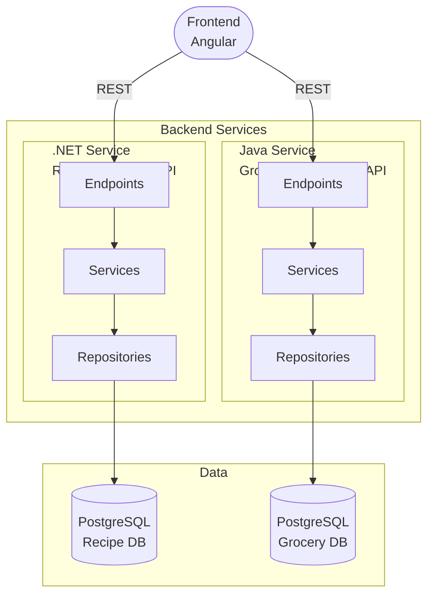

# Smart Meal Planner

Smart Meal Planner is a fullstack microservice-based platform for recipes, meal planning, grocery lists, pantry inventory and grocery budget tracking.

## Goals
- Build a useful daily-life application
- Refresh practical .NET and Java Spring Boot skills
- Practice REST APIs, PostgreSQL, authentication and testing
- Practice Docker, CI/CD, Kubernetes and monitoring
- Create real project stories for future technical interviews

---

## Architecture



> No API Gateway/BFF is used in the first phase. It can be added later as an advanced improvement.

---

## Tech Stack

| Layer | Technology |
|-------|------------|
| Frontend | Angular |
| .NET Backend | ASP.NET Core Minimal API, EF Core, FluentValidation, xUnit |
| Java Backend | Spring Bot, Spring Security, Spring Data JPA, JUnit |
| Database | PostgreSQL |
| Infrastructure | Docker, Docker Compose, GitHub Actions, Jenkins, Kubernetes |
| Testing | xUnit, JUnit, Cypress, Playwright |

---

## Main Features
- Recipe management
- Ingredient management
- Grocery list management
- Weekly meal planning
- Pantry inventory
- Expiry reminders
- Grocery budget reports
- Receipt upload

---

## Project Structure

```
smart-meal-planner
|-- README.md       <-- you are here
|
|-- services
|   |-- backend-dotnet-recipe-budget
|   |   |-- README.md
|   |   |-- ...
|   |-- backend-java-grocery-mealplan
|       |-- README.md
|       |-- ...
|
|-- frontend
|   |-- README.md
|   |-- ...
|
|-- docs
|   |-- ...
|
|-- infrastructure
    |-- docker
        |-- docker-compose.yml
        |-- .env.example
```

---

## Run Instructions

### 1. Clone the repository

```bash
git clone https://github.com/handyana-sa/smart-meal-planner.git
cd smart-meal-planner
```

### 2. Set up environment variables

```bash
cp .env.example .env
```

Edit `.env` with your values:

```env
# .NET Recipe & Budget API
DOTNET_POSTGRES_DB=recipedb
DOTNET_POSTGRES_USER=postgres
DOTNET_POSTGRES_PASSWORD=yourpassword
DOTNET_CONNECTION_STRING=Host=db-recipe;Port=5432;Database=recipedb;Username=postgres;Password=yourpassword
```

### 3. Run everything with Docker Compose

```bash
docker compose up --build
```
| Service | URL |
|---------|-----|
| .NET API | http://localhost:5000 |
| .NET Swagger | http://localhost:5000/swagger |

### 4. Run individual services

See each service's own README for detailed run instructions:

- [.NET Recipe & Budget API](./services/backend-dotnet-recipe-budget/README.md)

---

## Run Tests

```bash
# .NET Tests
cd backend-dotnet-recipe-budget
dotnet test

# Java Tests - TODO

# Frontend Tests - TODO


```

---

## Services

### .NET Recipe & Budget API

Manages recipes, ingredients and estimated costs.
-> [Full documentation](./services/backend-dotnet-recipe-budget/README.md)

---

## Docker & DB Persistence

All docker are **stateless**, data is never stored inside containers. Each service has its own PostgreSQL container with named volume:

```yaml
volumes:
  postgres_recipe_data:       # <-- Recipe & Budget data
  postgres_grocery_data:      # <-- Grocery & Meal Plan data
```

| Command | Effect |
|---------|--------|
| `docker compose down` | Stops containers - data kept ✅ |
| `docker compose down -v` | Stops containers — data deleted ⚠️ |

---

## Status

| Service | Status |
|---------|--------|
| .NET Recipe & Budget API | 🟢 In progress |
| Java Grocery & Meal Plan API | 🔴 Not started |
| Angular Frontend | 🔴 Not started |

---


