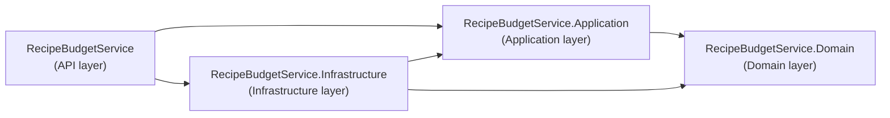
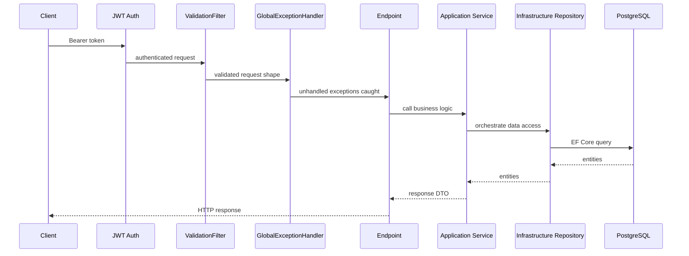

       

# Recipe Budget Service (.NET)

A RESTful API service for managing recipes, ingredients, and grocery expenses with budget tracking. Built using **Clean Architecture** principles with separated concerns across Domain, Application, Infrastructure, and API (Presentation) layers.

> **JWT authentication is implemented.** See [Authentication](#-authentication) below — all Recipe, Ingredient, and Expense endpoints require a valid Bearer token.

## 🏗️ Architecture Overview

This project follows **Clean Architecture** with four layers, split across 5 projects (the 5th being the test project). Dependencies always point inward, toward Domain:



- **Domain Layer** (`RecipeBudgetService.Domain`): Core business entities and domain exceptions — no dependencies on any other project
- **Application Layer** (`RecipeBudgetService.Application`): Business logic, services, DTOs, and repository interfaces — depends only on Domain
- **Infrastructure Layer** (`RecipeBudgetService.Infrastructure`): Database access and EF Core implementations — depends on Domain and Application
- **API Layer** (`RecipeBudgetService`): API endpoints, middleware, validators, and dependency injection — depends on all three other layers

### Request flow



## 🚀 Tech Stack

| Component | Technology |
|-----------|-----------|
| **Framework** |  |
| **Language** |  |
| **Architecture** | Clean Architecture (Domain / Application / Infrastructure / API) |
| **Database** |  |
| **ORM** |  |
| **Validation** |  |
| **API Docs** |  (Scalar UI) |
| **Container** |  |
| **Testing** |  |
| **Auth** | JWT Bearer tokens + BCrypt password hashing |

## 📁 Project Structure

```
services/backend-dotnet-recipe-budget/
├── RecipeBudgetService/                    # API layer (entry point)
│   ├── Endpoints/          # RecipeEndpoints, IngredientEndpoints, GroceryExpenseEndpoints
│   ├── Filters/            # ValidationFilter<T>
│   ├── Middleware/         # GlobalExceptionHandler
│   ├── Validators/         # FluentValidation validators
│   ├── Migrations/         # EF Core migrations
│   ├── Program.cs
│   └── Dockerfile
│
├── RecipeBudgetService.Application/        # Application layer
│   ├── DTOs/               # Request/Response contracts
│   ├── Services/           # RecipeService, IngredientService, ExpenseService
│   ├── Repositories/       # Repository interfaces (IRecipeRepository, etc.)
│   ├── Mappers/            # Entity ↔ DTO extension methods
│   └── Extensions/         # GuardExtensions
│
├── RecipeBudgetService.Domain/             # Domain layer
│   ├── Entities/           # Recipe, Ingredient, GroceryExpense, ExpenseCategory
│   └── Exceptions/         # NotFoundException, ConflictException, ValidationException
│
├── RecipeBudgetService.Infrastructure/     # Infrastructure layer
│   ├── Data/               # AppDbContext
│   └── Repositories/       # Repository implementations
│
└── RecipeBudgetService.Tests/
    ├── UnitTests/           # Service layer tests — mock repository interfaces
    └── IntegrationTests/    # Repository + endpoint tests
```

**Dependency rule**: Domain has no dependencies on other projects → Application depends only on Domain → Infrastructure depends on Domain and Application → the API project (`RecipeBudgetService`) depends on all three. Dependencies always point inward.

## 🛠️ Features

- ✅ Recipe management (CRUD operations)
- ✅ Ingredient management with pricing
- ✅ Grocery expense tracking and categorization
- ✅ Expense summary
- ✅ RESTful API with OpenAPI documentation (Scalar)
- ✅ Comprehensive error handling
- ✅ Input validation with FluentValidation
- ✅ JWT authentication (register, login, refresh, logout) with BCrypt password hashing
- ✅ User-scoped recipes and expenses — every user only sees their own data
- 🚧 Monthly spending report — planned, not yet implemented

## 🔐 Authentication

- Stateless JWT Bearer tokens, validated per-request
- Refresh tokens stored in the database, invalidated on logout
- User id extracted from JWT claims in the endpoint, passed down to services as a parameter — services never touch `HttpContext` directly

### Register

```json
// POST /api/auth/register
{
  "email": "user@example.com",
  "password": "SecurePass1"
}

// 201 Created
{
  "accessToken": "eyJhbGci...",
  "refreshToken": "abc123...",
  "expiresAt": "2026-05-29T10:15:00Z"
}
```

### Login

```json
// POST /api/auth/login
{
  "email": "user@example.com",
  "password": "SecurePass1"
}

// 200 OK
{
  "accessToken": "eyJhbGci...",
  "refreshToken": "abc123...",
  "expiresAt": "2026-05-29T10:15:00Z"
}
```

### Refresh

```json
// POST /api/auth/refresh
{
  "refreshToken": "abc123..."
}

// 200 OK
{
  "accessToken": "eyJhbGci...",
  "refreshToken": "xyz789...",
  "expiresAt": "2026-05-29T10:30:00Z"
}
```

### Logout

```json
// POST /api/auth/logout
{
  "refreshToken": "abc123..."
}

// 204 No Content
```

### Using the token

```http
GET /api/recipes
Authorization: Bearer eyJhbGci...
```

### Password validation rules

- Minimum 8 characters
- At least one uppercase letter
- At least one lowercase letter
- At least one number

### Token expiry

| Token | Expiry |
|---|---|
| Access token | 15 minutes |
| Refresh token | 7 days |

## 📚 API Endpoints

> 🔒 marks endpoints that require a valid Bearer token. Recipes and Expenses are user-scoped — each user only sees and manages their own data; accessing another user's resource returns `404` (not `403`, to avoid revealing existence).

#### Auth (public — no token required)

| Method | Endpoint | Body | Response |
|---|---|---|---|
| `POST` | `/api/auth/register` | `RegisterRequest` | `201`, `400`, `409` |
| `POST` | `/api/auth/login` | `LoginRequest` | `200`, `400`, `401` |
| `POST` | `/api/auth/refresh` | `RefreshTokenRequest` | `200`, `400`, `401` |
| `POST` | `/api/auth/logout` | `RefreshTokenRequest` | `204` |

#### Recipes (🔒 requires Bearer token — user-scoped)

| Method | Endpoint | Body | Response |
|---|---|---|---|
| `GET` | `/api/recipes` | — | `200` + list |
| `GET` | `/api/recipes/{id}` | — | `200`, `404` |
| `POST` | `/api/recipes` | `RecipeRequest` | `201`, `400`, `409` |
| `PUT` | `/api/recipes/{id}` | `RecipeRequest` | `200`, `400`, `404`, `409` |
| `DELETE` | `/api/recipes/{id}` | — | `204` |

#### Ingredients (🔒 requires Bearer token — user-scoped via recipe)

| Method | Endpoint | Body | Response |
|---|---|---|---|
| `POST` | `/api/recipes/{id}/ingredients` | `IngredientRequest` | `201`, `400`, `404` |
| `DELETE` | `/api/recipes/{id}/ingredients/{iId}` | — | `204` |

#### Expenses (🔒 requires Bearer token — user-scoped)

| Method | Endpoint | Body | Response |
|---|---|---|---|
| `GET` | `/api/expenses` | — | `200` + list |
| `GET` | `/api/expenses/{id}` | — | `200`, `404` |
| `GET` | `/api/expenses/summary` | — | `200` + summary |
| `GET` | `/api/expenses/category/{category}` | — | `200` + list |
| `POST` | `/api/expenses` | `GroceryExpenseRequest` | `201`, `400`, `404` |
| `PUT` | `/api/expenses/{id}` | `GroceryExpenseRequest` | `200`, `400`, `404` |
| `DELETE` | `/api/expenses/{id}` | — | `204` |

#### Reports — planned, not yet implemented

| Method | Endpoint | Params | Response |
|---|---|---|---|
| `GET` | `/api/reports/monthly-spending` | `?month=5&year=2026` | `200`, `400` |

#### Health (public)

| Method | Endpoint | Response |
|---|---|---|
| `GET` | `/health` | `200 Healthy` |

## 🚀 Getting Started

### Prerequisites

- .NET 10 SDK
- PostgreSQL 16+
- Docker (optional)

### Setup

1. Copy `infrastructure/docker/.env.example` to `.env` and fill in real values (or configure the connection string and JWT settings directly in `appsettings.Development.json` for local dev — `JWT_SECRET` is **required**, the app fails to start without it)
2. Run: `dotnet restore`
3. Run: `dotnet ef database update`
4. Run: `dotnet run --project RecipeBudgetService`
5. Visit: `https://localhost:5001/scalar`

### `.env` variables

```env
# Database
POSTGRES_DB=recipedb
POSTGRES_USER=postgres
POSTGRES_PASSWORD=yourpassword
CONNECTION_STRING=Host=db;Port=5432;Database=recipedb;Username=postgres;Password=yourpassword

# JWT — all required, app fails to start if JWT_SECRET is missing
JWT_SECRET=your-super-secret-key-minimum-32-characters
JWT_ISSUER=smart-meal-planner
JWT_AUDIENCE=smart-meal-planner-client
JWT_ACCESS_TOKEN_EXPIRY_MINUTES=15
JWT_REFRESH_TOKEN_EXPIRY_DAYS=7
```

## 🧪 Testing

```bash
# Run all tests
dotnet test

# Run only unit tests
dotnet test --filter FullyQualifiedName~UnitTests

# Run only integration tests
dotnet test --filter FullyQualifiedName~IntegrationTests
```

## 📖 Clean Architecture Principles

- Dependencies flow inward (toward Domain)
- Domain layer has zero external dependencies
- Business logic is independent of frameworks
- Easy to test and maintain
- Easy to swap implementations

## 🤝 Contributing

Contributions are welcome! Please fork, create a feature branch, and submit a pull request.
