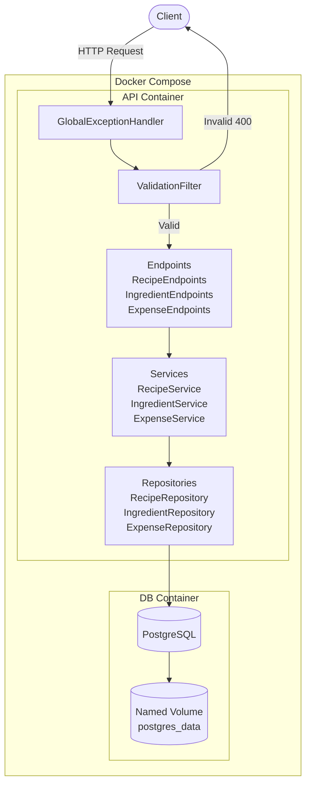
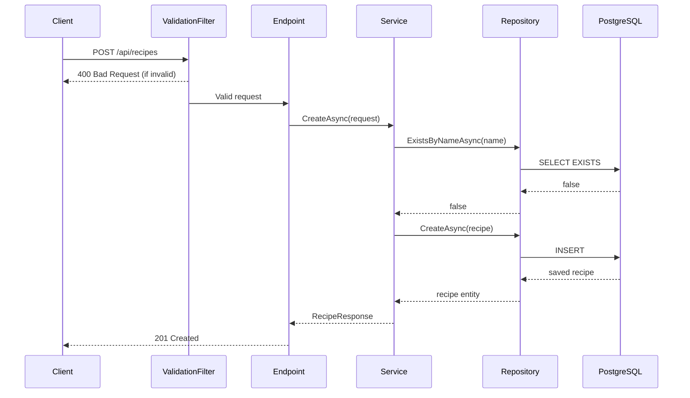

# Recipe & Budget API

.NET 10 ASP.NET Core Minimal API for managing recipes, ingredients and estimated costs.

Part of the [Smart Meal Planner](../../README.md) project.

---

## Architecture



---

## Request Flow



---

## Tech Stack

- **.NET 10** - ASP.NET Core Minimal API
- **PostgreSQL** - primary database
- **Entity Framework Core** - ORM
- **FluentValidation** - request validation
- **xUnit + FluentAssertions + Moq** - testing
- **Docker** - containerization

---

## Project Structure

```
backend-dotnet-recipe-budget/
├── RecipeBudgetService
│   ├── Common/
│   │   ├── Exceptions/         # NotFoundException, ConflictException
│   │   ├── Filters/            # ValidationFilter
│   │   ├── Guards/             # Guard.ThrowIfEmpty, ThrowIfNullOrWhiteSpace
│   │   ├── Mappers/           # RecipeMappings, IngredientMappings
│   │   └── Middleware/         # GlobalExceptionHandler
│   ├── Data/
│   │   └── AppDbContext.cs
│   ├── DTOs/
│   │   ├── ExpenseSummaryResponse.cs
│   │   ├── GroceryExpenseRequest.cs
│   │   ├── GroceryExpenseResponse.cs
│   │   ├── RecipeRequest.cs
│   │   ├── RecipeResponse.cs
│   │   ├── IngredientRequest.cs
│   │   └── IngredientResponse.cs
│   ├── Endpoints/
│   │   ├── RecipeEndpoints.cs
│   │   ├── IngredientEndpoints.cs
│   │   └── GroceryExpenseEndpoints.cs
│   ├── Entities/
│   │   ├── Recipe.cs
│   │   ├── Ingredient.cs
│   │   └── GroceryExpense.cs
│   ├── Repositories/
│   │   ├── IRecipeRepository.cs
│   │   ├── RecipeRepository.cs
│   │   ├── IIngredientRepository.cs
│   │   ├── IngredientRepository.cs
│   │   ├── IExpenseRepository.cs
│   │   └── ExpenseRepository.cs
│   ├── Services/
│   │   ├── IRecipeService.cs
│   │   ├── RecipeService.cs
│   │   ├── IIngredientService.cs
│   │   ├── IngredientService.cs
│   │   ├── IExpenseService.cs
│   │   └── ExpenseService.cs
│   └── Validators/
│       ├── RecipeRequestValidator.cs
│       ├── IngredientRequestValidator.cs
│       └── GroceryExpenseRequestValidator.cs
└── BudgetService.Tests
    ├── Fixtures
    ├── IntegrationTests
    │   ├── Endpoints
    │   │   ├── BaseEndpointsIntegrationTests.cs
    │   │   └── RecipeEndpointsTests.cs
    │   ├── Repositories
    │   │   ├── IngredientRepositoryTests.cs
    │   │   └── RecipeRepositoryTests.cs
    │   ├── Services
    │   │   ├── IngredientServiceTests.cs
    │   │   └── RecipeServiceTests.cs
    │   └── TestWebApplicationFactory.cs
    └── UnitTests
        ├── Common
        │   ├── Middleware
        │   └── Validators
        └── Services
            ├── IngredientServiceTests.cs
            └── RecipeServiceTests.cs
```

---

## Run Instructions

### With Docker Compose (from root)

```bash
docker compose up --build
```

### Local development

```bash
dotnet restore
dotnet run
```

Add `appsettings.Development.json`

```json
{
  "ConnectionStrings": {
    "DefaultConnection": "Host=localhost;Port=5432;Database=recipedb;Username=postgres;Password=yourpassword"
  }
}
```

---

## Run Tests

```bash
# all tests
dotnet test

# unit tests only
dotnet test --filter "FullyQualifiedName~UnitTests"

# integration tests only
dotnet test --filter "FullyQualifiedName~IntegrationTests"
```

---

## API Endpoints

### Recipes

| Method | Endpoint | Description | Body | Response |
|--------|----------|-------------|------|----------|
| `GET` | `/api/recipes` | Get all recipes | — | `200` |
| `GET` | `/api/recipes/{id}` | Get recipe by id | — | `200`, `404` |
| `POST` | `/api/recipes` | Create recipe | `RecipeRequest` | `201`, `400`, `409` |
| `PUT` | `/api/recipes/{id}` | Update recipe | `RecipeRequest` | `200`, `400`, `404`, `409` |
| `DELETE` | `/api/recipes/{id}` | Delete recipe | — | `204` |

### Ingredients

| Method | Endpoint | Description | Body | Response |
|--------|----------|-------------|------|----------|
| `POST` | `/api/recipes/{id}/ingredients` | Add ingredient | `IngredientRequest` | `201`, `400`, `404` |
| `DELETE` | `/api/recipes/{id}/ingredients/{iId}` | Remove ingredient | — | `204` |

### Expenses

| Method | Endpoint | Description | Body | Response |
|--------|----------|-------------|------|----------|
| `GET` | `/api/expenses` | Get all expenses | — | `200` |
| `GET` | `/api/recipes/{id}` | Get expense by id | — | `200`, `404` |
| `GET` | `/api/expenses/summary` | Get summary | — | `200` |
| `GET` | `/api/expenses/category/{category}` | Get by category | `ExpenseCategory` | `200` |
| `POST` | `/api/expenses` | Create expense | `GroceryExpenseRequest` | `201`, `400`, `404` |
| `PUT` | `/api/expenses/{id}` | Update expense | `GroceryExpenseRequest` | `200`, `400`, `404` |
| `DELETE` | `/api/expenses/{id}` | Delete expense | — | `204` |

### Request / Response Examples

#### `RecipeRequest`
```json
{
  "name": "Pasta Carbonara",
  "description": "A delicious pasta carbonara recipe",
  "servings": 2,
  "ingredients": [
    {
      "name": "Spaghetti",
      "quantity": 200,
      "unit": "g",
      "pricePerUnit": 0.01
    }
  ]
}
```

#### `RecipeResponse`
```json
{
  "id": "3fa85f64-5717-4562-b3fc-2c963f66afa6",
  "name": "Pasta Carbonara",
  "description": "A delicious pasta carbonara recipe",
  "servings": 2,
  "estimatedCost": 2.00,
  "createdAt": "2026-05-29T10:00:00Z",
  "ingredients": [
    {
      "id": "7cb85f64-1234-4562-b3fc-2c963f66afa6",
      "name": "Spaghetti",
      "quantity": 200,
      "unit": "g",
      "pricePerUnit": 0.01,
      "totalCost": 2.00
    }
  ]
}
```

---

## Docker & DB Persistence

The API container is **stateless** — only code lives inside it. All data persists in a named Docker volume attached to the PostgreSQL container:

```yaml
services:
  db:
    image: postgres:16
    volumes:
      - postgres_data:/var/lib/postgresql/data

volumes:
  postgres_data:
```

| Command | Effect |
|---------|--------|
| `docker compose down` | Keeps data ✅ |
| `docker compose down -v` | Deletes data ⚠️ |

